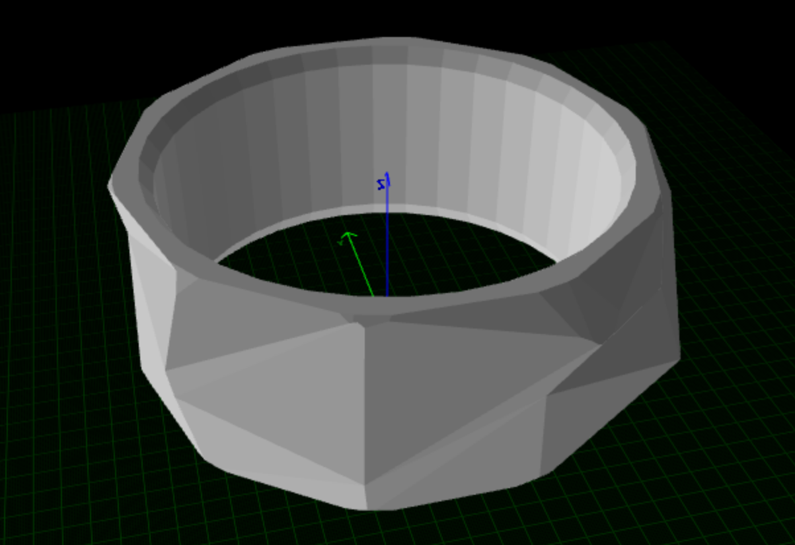

# 🧬 Bio-Printing Trajectory Generation (SLERP & LERP)

This repository contains a spatial trajectory planning algorithm developed for bio-printing applications. The code processes 3D models in STL format, computes an optimized path over the surface, and ensures smooth orientation transitions of the printhead using Linear Interpolation (LERP) and Spherical Linear Interpolation (SLERP).

## Project Overview

In bio-printing over complex 3D geometries, it is essential to control not only the spatial position of the printhead \((X, Y, Z)\), but also its orientation relative to the surface. This project addresses that problem by generating a continuous trajectory that keeps the tool aligned with the local surface normals of the mesh.

The main workflow is:

1. **Load the STL mesh** and extract all triangular faces.
2. **Compute triangle centers and normal vectors** for the mesh.
3. **Convert normals into quaternions** so the tool orientation can be represented robustly in 3D space.
4. **Sort the points using a KDTree-based nearest-neighbor strategy** to build a more continuous path.
5. **Interpolate positions with LERP** and orientations with SLERP** to obtain a smooth, denser trajectory for execution or visualization.

## Requirements
This project uses Python and the following libraries:
```bash
pip install numpy matplotlib numpy-stl scipy
```
## Usage

1. Place your STL file in the root directory of the project.
2. Make sure the script points to the correct STL filename.
3. Run the program:
```bash
python slerp.py
```

## Visual Results

1. Original Mesh


2. Interpolated Trajectory and Orientation
- The blue line represents the interpolated spatial trajectory.
- The red arrows represent the interpolated orientation of the printhead along the path.


## Main Functions

**quat_from_two_vectors(u, v):** Computes the quaternion that rotates a reference vector into a target normal vector.

**slerp_quat(q0, q1, t):** Interpolates smoothly between two unit quaternions.

**KDTree_sort(centers, quats):** Sorts the mesh centers and corresponding quaternions using a nearest-neighbor approach based on KDTree.

**interpolate_full_trajectory(centers_ord, quats_ord, factor_densidad=10):** Generates intermediate trajectory points by applying:

- LERP to the positions.
- SLERP to the orientations.

**visualize_final_result(pos_interp, quat_interp):** Displays the interpolated 3D path and the corresponding orientation vectors.

## Research Context
This work was developed as part of a research documentation effort for bio-printing applications, with emphasis on smooth trajectory generation over curved surfaces and stable orientation control using quaternion-based interpolation.

## Future Work
Possible extensions of this project include:

- Exporting the generated trajectory to a robot-readable format.
- Adding support for multiple mesh topologies.
- Improving path optimization for large-scale meshes.
- Integrating the planner into a robotic bio-printing pipeline